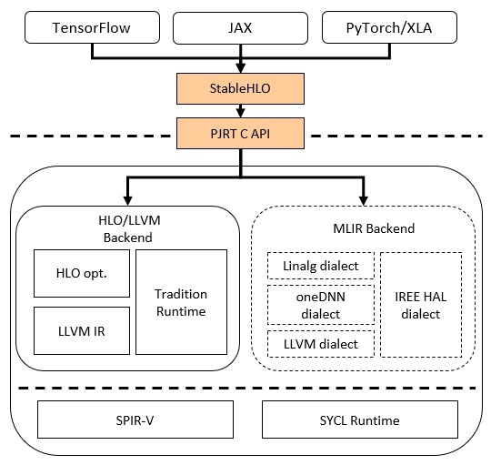

# Intel® Extension for OpenXLA*

[](https://badge.fury.io/py/intel-extension-for-openxla)
[](https://badge.fury.io/py/intel-extension-for-openxla)
[](https://github.com/intel/intel-extension-for-openxla/releases)
[](LICENSE.txt)

The [OpenXLA](https://github.com/openxla/xla) Project brings together a community of developers and leading AI/ML teams to accelerate ML and address infrastructure fragmentation across ML frameworks and hardware.

Intel® Extension for OpenXLA includes PJRT plugin implementation, which seamlessly runs JAX models on Intel GPU. The PJRT API simplified the integration, which allowed the Intel GPU plugin to be developed separately and quickly integrated into JAX. This same PJRT implementation also enables initial Intel GPU support for TensorFlow and PyTorch models with XLA acceleration. Refer to [OpenXLA PJRT Plugin RFC](https://github.com/openxla/community/blob/main/rfcs/20230123-pjrt-plugin.md) for more details.

This guide introduces the overview of OpenXLA high level integration structure and demonstrates how to build Intel® Extension for OpenXLA and run JAX example with OpenXLA on Intel GPU. JAX is the first supported front-end.

## 1. Overview

 <p align="center">
	 
 </p>

* [JAX](https://jax.readthedocs.io/en/latest/) provides a familiar NumPy-style API, includes composable function transformations for compilation, batching, automatic differentiation, and parallelization, and the same code executes on multiple backends.
* TensorFlow and PyTorch support is on the way.

## 2. Requirements

### Hardware Requirements

Verified Hardware Platforms:

* Intel® Data Center GPU Max Series, Driver Version: [803](https://dgpu-docs.intel.com/releases/LTS_803.29_20240131.html)

* Intel® Data Center GPU Flex Series 170, Driver Version: [803](https://dgpu-docs.intel.com/releases/LTS_803.29_20240131.html)

### Software Requirements

* Ubuntu 22.04 (64-bit)
  * Intel® Data Center GPU Flex Series
* Ubuntu 22.04, SUSE Linux Enterprise Server(SLES) 15 SP4
  * Intel® Data Center GPU Max Series
* Intel® oneAPI Base Toolkit 2024.0
* Jax/Jaxlib 0.4.24
* Python 3.9-3.11
* pip 19.0 or later (requires manylinux2014 support)

**NOTE: Since Jax has its own [platform limitation](https://jax.readthedocs.io/en/latest/installation.html#supported-platforms) (Ubuntu 20.04 or later), real software requirements is restricted when works with Jax.**

### Install Intel GPU Drivers

|OS|Intel GPU|Install Intel GPU Driver|
|-|-|-|
|Ubuntu 22.04 |Intel® Data Center GPU Flex Series|  Refer to the [Installation Guides](https://dgpu-docs.intel.com/installation-guides/index.html#intel-data-center-gpu-flex-series) for latest driver installation. If install the verified Intel® Data Center GPU Max Series/Intel® Data Center GPU Flex Series [803](https://dgpu-docs.intel.com/releases/LTS_803.29_20240131.html), please append the specific version after components, such as `sudo apt-get install intel-opencl-icd==23.43.27642.38-803~22.04`|
|Ubuntu 22.04, SLES 15 SP4|Intel® Data Center GPU Max Series|  Refer to the [Installation Guides](https://dgpu-docs.intel.com/installation-guides/index.html#intel-data-center-gpu-max-series) for latest driver installation. If install the verified Intel® Data Center GPU Max Series/Intel® Data Center GPU Flex Series [803](https://dgpu-docs.intel.com/releases/LTS_803.29_20240131.html), please append the specific version after components, such as `sudo apt-get install intel-opencl-icd==23.43.27642.38-803~22.04`|

### Install oneAPI Base Toolkit Packages

Need to install components of Intel® oneAPI Base Toolkit:

* Intel® oneAPI DPC++ Compiler
* Intel® oneAPI Math Kernel Library (oneMKL)
* Intel® oneAPI Threading Building Blocks (TBB), dependency of DPC++ Compiler.

```bash
wget https://registrationcenter-download.intel.com/akdlm//IRC_NAS/20f4e6a1-6b0b-4752-b8c1-e5eacba10e01/l_BaseKit_p_2024.0.0.49564.sh
# 2 components are necessary: DPC++/C++ Compiler and oneMKL
sudo sh l_BaseKit_p_2024.0.0.49564.sh

# Source OneAPI env
source /opt/intel/oneapi/compiler/2024.0/env/vars.sh
source /opt/intel/oneapi/mkl/2024.0/env/vars.sh
```

### Install Jax and Jaxlib

```bash
pip install jax==0.4.24 jaxlib==0.4.24
```

## 3. Install

### Install via PyPI wheel

```bash
pip install --upgrade intel-extension-for-openxla
```

### Install from Source Build

**NOTE: Extra software (GCC 10.0.0 or later) is required if want to build from source.**
```bash
git clone https://github.com/intel/intel-extension-for-openxla.git
./configure        # Choose Yes for all.
bazel build //xla/tools/pip_package:build_pip_package
./bazel-bin/xla/tools/pip_package/build_pip_package ./
pip install intel_extension_for_openxla-0.2.0-cp39-cp39-linux_x86_64.whl
```

**Aditional Build Option**:

This repo pulls public XLA code as its third party build dependency. As an openxla developer, you may need to modify and override this specific XLA repo with a local checkout version by the following command:

```bash
bazel build --override_repository=xla=/path/to/xla //xla/tools/pip_package:build_pip_package
```

**Custom Library Path**:

By default, bazel will automatically search for the required libraries on your system. This eliminates the need for manual configuration in most cases. For more advanced use cases, you can specify a custom location for the libraries using environment variables:

```bash
export ONEAPI_MKL_PATH=/opt/intel/oneapi/mkl/2024.2
export L0_INSTALL_PATH=/usr
bazel build //xla/tools/pip_package:build_pip_package
```

## 4. Run JAX Example

### Run the below jax python code

When running jax code, `jax.local_devices()` can check which device is running.

```python
import jax
import jax.numpy as jnp
import jax
print("jax.local_devices(): ", jax.local_devices())

@jax.jit
def lax_conv():
  key = jax.random.PRNGKey(0)
  lhs = jax.random.uniform(key, (2,1,9,9), jnp.float32)
  rhs = jax.random.uniform(key, (1,1,4,4), jnp.float32)
  side = jax.random.uniform(key, (1,1,1,1), jnp.float32)
  out = jax.lax.conv_with_general_padding(lhs, rhs, (1,1), ((0,0),(0,0)), (1,1), (1,1))
  out = jax.nn.relu(out)
  out = jnp.multiply(out, side)
  return out

print(lax_conv())
```

### Reference result

```bash
jax.local_devices():  [xpu(id=0), xpu(id=1)]
[[[[2.0449753 2.093208  2.1844783 1.9769732 1.5857391 1.6942389]
   [1.9218378 2.2862523 2.1549542 1.8367321 1.3978379 1.3860377]
   [1.9456574 2.062028  2.0365305 1.901286  1.5255247 1.1421617]
   [2.0621    2.2933435 2.1257985 2.1095486 1.5584903 1.1229166]
   [1.7746235 2.2446113 1.7870374 1.8216239 1.557919  0.9832508]
   [2.0887792 2.5433128 1.9749291 2.2580051 1.6096935 1.264905 ]]]
 [[[2.175818  2.0094342 2.005763  1.6559253 1.3896458 1.4036925]
   [2.1342552 1.8239582 1.6091168 1.434404  1.671778  1.7397764]
   [1.930626  1.659667  1.6508744 1.3305787 1.4061482 2.0829628]
   [2.130649  1.6637266 1.594426  1.2636002 1.7168686 1.8598001]
   [1.9009514 1.7938274 1.4870623 1.6193901 1.5297288 2.0247464]
   [2.0905268 1.7598859 1.9362347 1.9513799 1.9403584 2.1483061]]]]
```

## 5. FAQ

1. If there is an error 'No visible XPU devices', print `jax.local_devices()` to check which device is running. Set `export OCL_ICD_ENABLE_TRACE=1` to check if there are driver error messages. The following code opens more debug log for JAX app.

    ```python
    import logging
    logging.basicConfig(level = logging.DEBUG)
    ```

2. If there is an error 'version GLIBCXX_3.4.30' not found, upgrade libstdc++ to the latest, for example for conda

    ```bash
    conda install libstdcxx-ng==12.2.0 -c conda-forge
    ```

3. If there is an error '/usr/bin/ld: cannot find -lstdc++: No such file or directory' during source build under Ubuntu 22.04, check the selected GCC-toolchain path and the installed libstdc++.so library path, then create symbolic link of the selected GCC-toolchain path to the libstdc++.so path, for example:
    ```bash
    icx -v # For example, the output of the "Selected GCC installation" is "/usr/lib/gcc/x86_64-linux-gnu/12".
    sudo apt install plocate
    locate libstdc++.so |grep /usr/lib/ # For example, the output of the library path is "/usr/lib/x86_64-linux-gnu/libstdc++.so.6".
    sudo ln -s /usr/lib/x86_64-linux-gnu/libstdc++.so.6 /usr/lib/gcc/x86_64-linux-gnu/12/libstdc++.so
    ```
