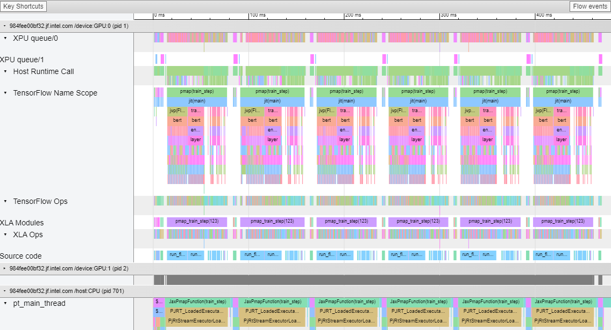
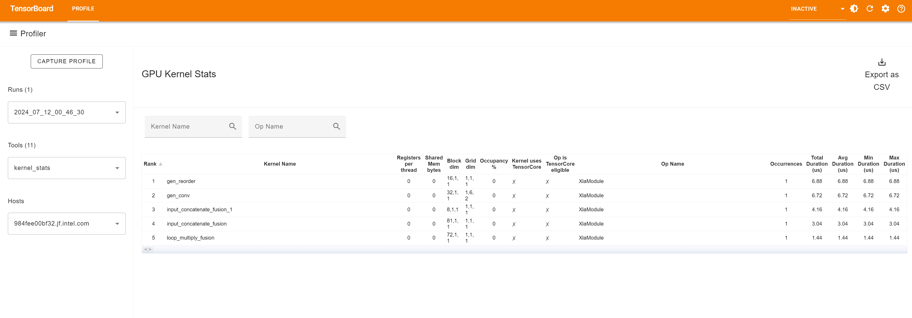
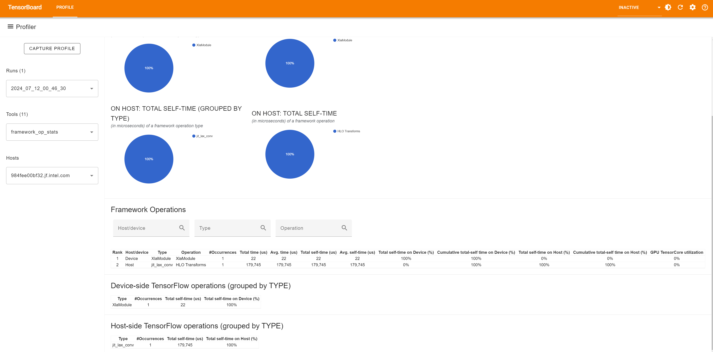
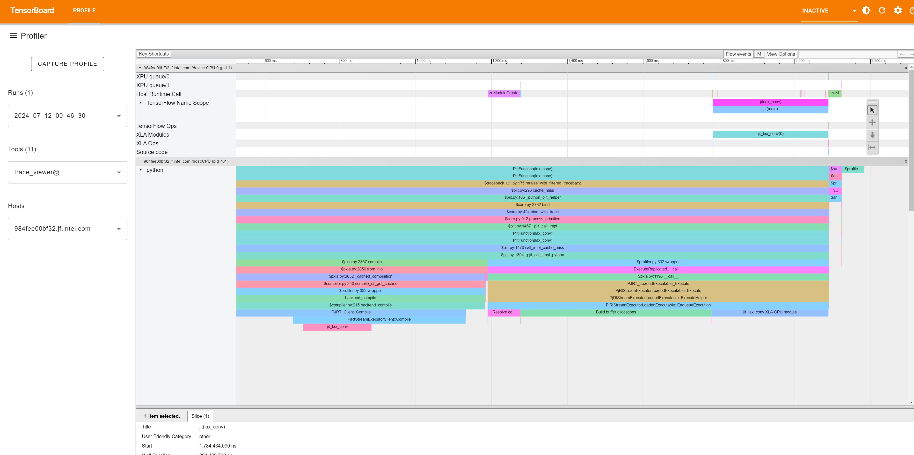
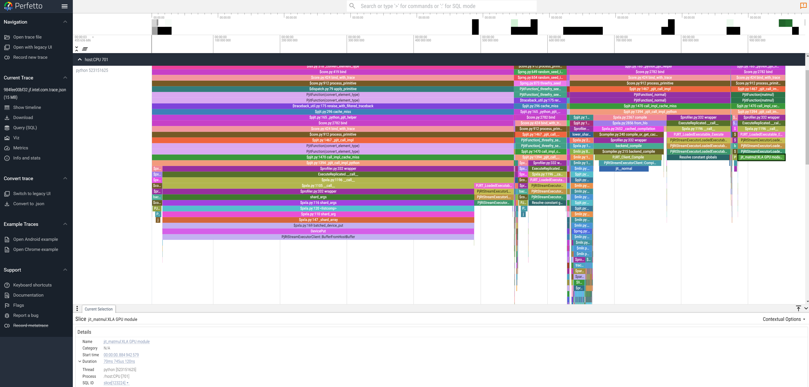

# GPU Profiler

Intel® Extension for OpenXLA* provides Profiler to track the performance of workloads running on the Intel GPU. [PJRT_C_API](https://github.com/openxla/xla/blob/main/xla/backends/profiler/plugin/profiler_c_api.h) lets third-party plugin communicate profiling data in XLA's native profiling format which takes a serialized XSpace object and fills the object with runtime data obtained through the oneAPI [Level Zero](https://www.intel.com/content/www/us/en/developer/articles/technical/using-oneapi-level-zero-interface.html) low-level device interface.

Users can display the execution profile of specific XLA modules, XLA ops, GPU kernels and so on with profiling visualizer like TensorBoard or Perfetto.

## How to use
* Neccessary environment variables:

| env | functionality |
| --- | --- |
| ZE_ENABLE_TRACING_LAYER | Set to 1 to enable the Tracing Layer for Level-Zero API Tracing, see [L0 loader APIs](https://github.com/oneapi-src/level-zero/blob/77d092e314365cc54b9b873a47210a799ed5a77c/doc/loader_api.md?plain=1#L40) for more details. |
| UseCyclesPerSecondTimer | Set to 1 to help libraries with transition to the new resolution since time resolution returned by device properties has been changed to cycles/second in Level-Zero. |
| NEOReadDebugKeys | Set to 1 to read debug environment variables on Linux release builds, see [NEOReadDebugKeys](https://github.com/intel/compute-runtime/blob/master/FAQ.md#how-can-i-enable-reading-debug-environment-variables-on-linux-release-builds) for more details. |

* Script:
  ```
  import jax
  import jax.numpy as jnp

  print("jax.local_devices(): ", jax.local_devices())

  @jax.jit
  def lax_conv():
    key = jax.random.PRNGKey(0)
    lhs = jax.random.uniform(key, (2,1,9,9), jnp.float32)
    rhs = jax.random.uniform(key, (1,1,4,4), jnp.float32)
    side = jax.random.uniform(key, (1,1,1,1), jnp.float32)
    out = jax.lax.conv_with_general_padding(lhs, rhs, (1,1), ((0,0),(0,0)), (1,1), (1,1))
    out = jax.nn.relu(out)
    out = jnp.multiply(out, side)
    return out

  jax.profiler.start_trace("./profile_tmp")
  print(lax_conv())
  jax.profiler.stop_trace()
  ```

* Run:
  ```
  $ export ZE_ENABLE_TRACING_LAYER=1
  $ export UseCyclesPerSecondTimer=1
  $ python jax_conv.py
  ```
  When this computation is done, the program will generate a directory "profile_tmp", choose one of following tools to visualize profiling data collected in this directory.

### TensorBoard profiling
TensorBoard's profiler can be used to profiler JAX or TensorFlow programs. Tensorboard is a great way to acquire and visualize performance traces and profiles of your program. 

The end result looks something like this:
<p align="center">
  
</p>


* Requirement:
  ```
  pip install -U tensorboard-plugin-profile
  ```

* Run TensorBoard:  
  After executing above python script code, you will find the log files in ./profile_tmp. Then, run TensorBoard with following command:  
  ```
  tensorboard --logdir=./profile_tmp --bind_all
  ```

* Analyze the result from the Profile tab:
The GPU profiler supports the following profiling items:
  * kernel_stats:
  
  * framework_op_stats:
  

  * trace_viewer:
  


### Perfetto profiling
[Perfetto](https://ui.perfetto.dev/) is a high-performance system tracing and analysis tool primarily used for capturing and analyzing various performance events in Linux or Android systems. We can use Perfetto to visualize profiling data generated by JAX profiler.
After executing above python script code, you will find the log files in ./profile_tmp. Then follow below steps:
* Preparation
  Unzip the .gz file in ./profile_tmp:
  ```
  unzip xxx.trace.json.gz
  ```
  Then we can get a xxx.trace.json.

* Open the trace file within Perfetto:
  

## FAQ
  1.If you see "No dashboards are activated for the current data set." the first time you enter the TensorBoard in the browser:
  
     Refresh the page, and the profile should be shown.
